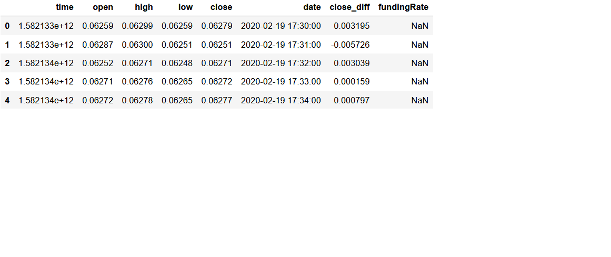
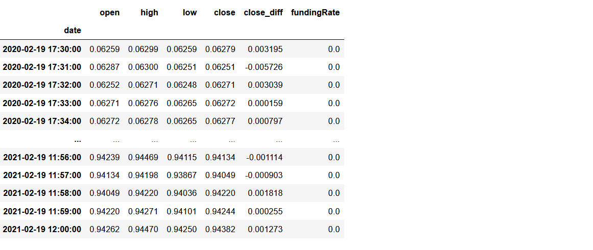
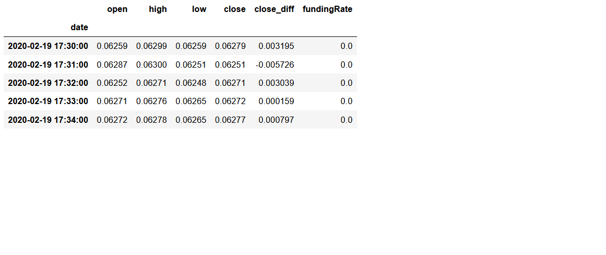
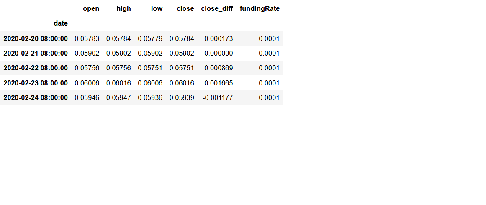
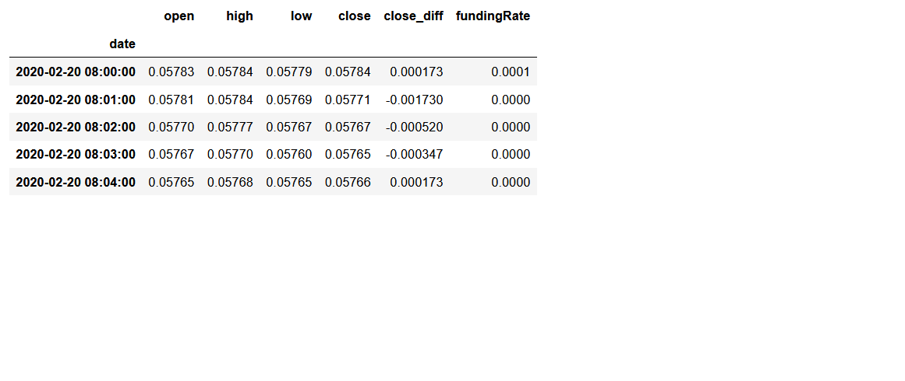
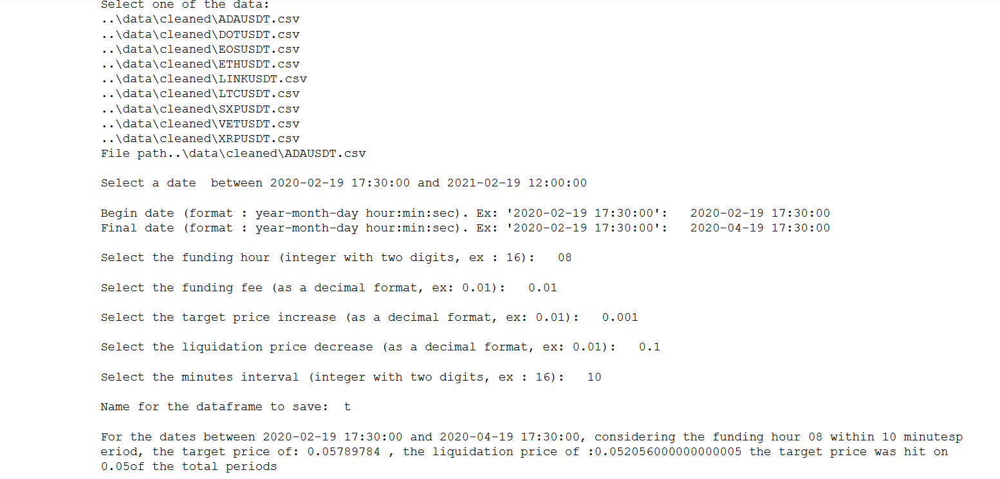

# Data-Analysis-Bitcoin-price-Klines

The goal of this project is to analyse the data from cryptocurrencies provided by the user.
For this the user should select some features as he desires. These are:
- The date range for the data analysis (two entries with the format: 2020-02-19 17:30:00)
- The hour which has a valid funding fee (like 08)
- The target funding fee (as a decimal)
- The target price increase (as a decimal)
- The liquidation price decrease (as a decimal)
- The minutes after the funding fee hour to be considered (as a integer)
- file name to be save the file

 The project is divided into three sections: 

 - **Data_Cleaner**: Cleans the dataframes in the original folder 

 - **Data_Analisys**: Uses the cleanead dataframe to slice the dataframe and provide the user with a report
  
 - **Web development**: With a dataframed provides a candle graph with data between a selected data period.
 

## Software & Libraries

The project uses Python 3 and the following libraries:

-   [Pandas](http://pandas.pydata.org/)
-   [glob](https://docs.python.org/3/library/glob.html)
-   [os](https://docs.python.org/3/library/os.html)
-   [Plotly](https://plotly.com/python/)
-   [Datetime](https://docs.python.org/3/library/datetime.html)

## How it works:

The original dataframe looks like this:

After the use of the function Data_Cleaner the dataframe looks like this:

This saves the dataframe automatically to the path : data/cleaned.
Now the user can run the function Data_Analisys. It will ask the user for the features mentioned above.

The first step that this function does is to slice the dataframe with the time lapse provided. It looks like this:

After that it uses the exact hour to make this dataframe:

The function then checks if the funding rate provided by the user is greater than the maximum of the funding rate provided by dataframe sliced by time lapse.
If it is not, then ends the function. Otherwise it first slice the dataframe getting the time lapse only within the selected hour plus the minutes provided by the user. It looks like this:

We start a counter that will provide the number of hits with 0.
Within this dataframe we get the base price of the currency as the first entry of the close price. Now the function iterates through the dataframe getting for each row the low, high and close prices. If the liquidation price (the base price multiplied by 1 minus the liquidation rate) is greater than the low  the counter is not updated. If the target price (the base price multiplied by 1 plus the target rate) is lower than the high the counter is updated (summed by 1).

Finally the percentage of hits is calculated by the counter divided by the total of iterations (lenght of the dataframe). The functions saves the final dataframe and prints this output:

